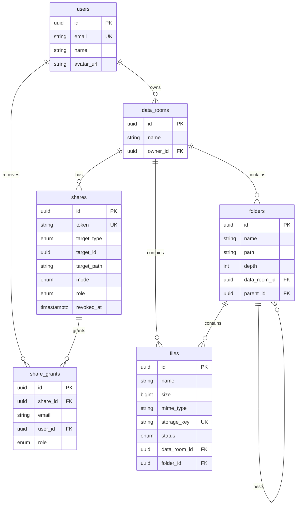

# GS1 Data Room

A virtual data room for securely storing and distributing documents during
due diligence.

**Live app:** https://gs1-dataroom-amber.vercel.app
**API:** https://gs1-dataroom.onrender.com/api

> The API runs on a free Render instance, which sleeps when idle. A keepalive
> ping runs every 10 minutes, but if the service has been down for a while the
> first request can take up to a minute.
>
> Sign-in is via Google. You may see an "unverified app" warning — expected
> for a take-home project requesting only basic profile scopes. Choose
> **Advanced → Continue** to proceed.

---

## Features

**Data rooms** — create, rename, delete. A room belongs to its owner and is
invisible to everyone else until explicitly shared.

**Folders** — nest to any depth, navigate by breadcrumbs, rename, and delete
along with all contents. Before deleting, the dialog states the exact number
of folders and files affected and their combined size.

**Files** — upload PDFs several at a time, by drag-and-drop or file picker,
with an independent progress bar per file. Preview in the app, rename with
name-conflict resolution, move between folders, delete.

**Sharing** — share a whole data room, a single folder, or a single file.
Recipients get read-only access including everything nested inside. Two
modes: a public link, and access granted to named people by email. The owner
can revoke access at any time.

### Not implemented

All required functionality from the brief is in place. The following is not:

- **Filename search** and **file versioning on name conflicts** — the
  optional extra-credit items. Name conflicts are resolved by appending a
  counter (`Report (2).pdf`) rather than by creating a version.
- **Moving folders.** The brief requires moving files, which works; folders
  cannot be moved. The data model already supports it — `path` is built from
  IDs, so a move is a single prefix-replacing `UPDATE` over the subtree — but
  the endpoint and UI were not built.
- **Cleanup of abandoned uploads.** Rows left in `PENDING` never appear
  anywhere, but they are never removed either.
- **Automated tests.**

---

## Stack

| Layer | Choice | Why |
|---|---|---|
| Backend | NestJS + TypeScript | Modular structure, built-in DI, predictable layout |
| ORM | Prisma 6 | Type-safe queries, migrations as files in the repo |
| Database | PostgreSQL (Supabase) | Relational constraints and composite indexes are load-bearing here |
| File storage | Supabase Storage | Private bucket, signed URLs, direct browser uploads |
| Auth | Supabase Auth (Google) | No reason to reimplement password handling in a document app |
| Frontend | Vite + React + TypeScript | Fast builds, no framework layer that isn't needed |
| Styling | Tailwind + shadcn/ui | Accessible components and consistent typography without building a design system |
| Client data | TanStack Query | Caching, invalidation, and loading/error states out of the box |
| Hosting | Vercel + Render | Auto-deploy from `main`, both free |

### Three decisions worth explaining

**Uploads go straight to storage, bypassing the API.** The backend issues a
signed URL and the browser `PUT`s bytes directly to Supabase Storage. Render's
free tier runs a single worker — proxying file bytes through it would block
every other request for the duration of the transfer. It also means upload
progress is measured on the real transfer rather than approximated.

**Tokens are verified against a public key, not a shared secret.** Supabase
signs JWTs with an asymmetric key. The backend fetches the JWKS once, caches
it, and verifies signatures locally. No shared secret in the environment, and
no round trip to Supabase per request.

**Supabase covers database, auth, and storage together.** One provider
instead of three: less configuration, and the database sits in the same
region (Frankfurt) as the backend, which removes 150–200 ms of round trip
from every query.

---

## Running locally

### Prerequisites

- Node.js 20+
- A Supabase project (free tier is enough)
- A Google OAuth client

### Install

```bash
git clone https://github.com/vladSparr/gs1-dataroom.git
cd gs1-dataroom

cd server && npm install
cd ../client && npm install
```

### Environment

`server/.env` — see `server/.env.example`:

| Variable | Purpose |
|---|---|
| `PORT` | Local server port, defaults to 3000 |
| `CORS_ORIGINS` | Comma-separated allowed origins |
| `DATABASE_URL` | Supabase transaction pooler, port 6543 |
| `DIRECT_URL` | Supabase session pooler, port 5432 — used for migrations |
| `SUPABASE_URL` | Supabase project URL |
| `SUPABASE_JWKS_URL` | Public key set used to verify access tokens |
| `SUPABASE_SERVICE_ROLE_KEY` | Server-side only, never exposed to the client |
| `SUPABASE_STORAGE_BUCKET` | Private bucket name, `dataroom-files` |

`client/.env.local` — see `client/.env.example`:

| Variable | Purpose |
|---|---|
| `VITE_API_URL` | API base URL, locally `http://localhost:3000/api` |
| `VITE_SUPABASE_URL` | Supabase project URL |
| `VITE_SUPABASE_ANON_KEY` | Publishable key — reaching the browser is by design |

The two database URLs are not a duplicate. Supabase's transaction pooler
cannot run the statements migrations need, so Prisma uses `DIRECT_URL` for
migrations and `DATABASE_URL` for everything else.

### Supabase setup

1. Create a project (Frankfurt region).
2. Storage → create bucket `dataroom-files`, **public access off**.
3. Authentication → Sign In / Providers → enable Google, paste the client ID
   and secret.
4. Authentication → URL Configuration → add redirect URLs:
   `http://localhost:5173/auth/callback` and the production equivalent.

In the Google OAuth client, the only authorised redirect URI is Supabase's
callback — `https://<project>.supabase.co/auth/v1/callback`. The app's own
URLs do not belong there.

### Run

```bash
cd server
npx prisma migrate dev
npm run start:dev          # http://localhost:3000

cd client
npm run dev                # http://localhost:5173
```

---

## Data model



### Materialised path instead of recursion

Every folder stores a `path` built from ancestor IDs:

```
room root      /a1b2…/f001…/
Financials     /a1b2…/f001…/f002…/
Reports 2025   /a1b2…/f001…/f002…/f003…/
```

An entire subtree is one query — `path LIKE '/a1b2…/f002…/%'` against an
indexed column. No recursive CTEs, no walking the tree in a loop. Breadcrumbs
come from splitting the string plus a single query for the names, at any
depth.

The important detail: the path holds **IDs, not names**. Renaming a folder
therefore touches no descendant rows. The only operation that rewrites paths
is a move, which is a single prefix-replacing `UPDATE`.

Each room has a real root folder row (`parent_id IS NULL`). Because of that,
files and folders always have a parent, which removes null handling from
every listing, move, and delete path in the codebase.

### Two-phase file rows

The file row is created **before** the browser transfers anything — the
storage key contains the file ID, so there is nothing to sign otherwise:

1. Client requests an upload URL.
2. Server resolves the final name, creates a row with status `PENDING`, and
   signs a URL for `{dataRoomId}/{fileId}`.
3. Browser uploads bytes directly to storage.
4. Client confirms completion; status becomes `READY`.

Listings show `READY` files only, so a tab closed mid-upload leaves an
invisible row rather than a broken entry.

Storage keys never contain filenames, so renaming is a database-only
operation.

### One access gate

All authorisation lives in a single service, evaluated in this order:

1. Room owner → allowed
2. Otherwise, find an active share whose `target_path` is a prefix of the
   resource's path
3. Public link → read-only access
4. Restricted share → read-only access if the caller's email has a grant
5. Otherwise → 404

Prefix matching is what makes nested sharing free: a share on a folder covers
its entire subtree and nothing above it, with one string comparison.

A resource the caller may not see returns **404, not 403** — a 403 would
confirm that an object with that ID exists.

---

## How it scales

### Computing total size and item count for a folder's whole subtree

Two indexed queries, both keyed on the path prefix:

```ts
// descendant folders
prisma.folder.count({
  where: { path: { startsWith: prefix }, id: { not: folderId } },
});

// file count and total size
prisma.file.aggregate({
  _count: true,
  _sum: { size: true },
  where: { status: 'READY', folder: { path: { startsWith: prefix } } },
});
```

Depth does not affect cost — these are index scans on `folders(path)`, not a
tree traversal, so no recursive query is needed at all.

If this became a hot path, the next step is a `folder_stats` table holding
precomputed values, maintained either by trigger or in application code.
That trades constant-time reads for write cost and a synchronisation burden
on every move. Not justified at this size, so it was deliberately left out.

### What changes at 100,000 files in one data room

**Already in place:**

- Cursor pagination on `(name, id)` — no `OFFSET`, which degrades linearly
  as the offset grows
- `files(folder_id, status, name)` fully covers the listing query: filter by
  folder and status, sort by name
- `folders(path)` for every subtree operation
- Listings are always scoped to one folder, so files-per-folder is the
  number that matters, not files-per-room

**What would need adding:**

- Server-side sorting and filtering instead of client-side
- A dedicated index for filename search — at that size `LIKE '%…%'` is no
  longer acceptable and a trigram or full-text index is required
- Row virtualisation in the table, so the browser is not holding 100,000
  DOM nodes
- The `folder_stats` table described above, since subtree aggregates over
  100,000 rows stop being free

### Extending sharing to per-user roles without remodelling

Already provided for. The schema has a `share_role` enum with `VIEWER` and
`EDITOR`, and a `role` column on both `shares` and `share_grants`. Only
`VIEWER` is currently used.

Adding editors is a behaviour change, not a structural one:

- The access service returns a capability set instead of a boolean
- Mutation endpoints consult that set
- The UI shows or hides actions accordingly

No migration required.

### Where AI was used

Substantially, and here is the split.

**What I did.** Broke the brief into six sequential stages and wrote each as
its own specification: goal, definition of done, file list, key signatures,
and known pitfalls. Made the architectural decisions the whole project rests
on — materialised path instead of recursive queries, a single access gate,
two-phase file rows, direct-to-storage uploads, revocation by timestamp
rather than deletion. Designed the Prisma schema myself, including the
indexes chosen for specific queries and the naming conventions. Wrote
`CLAUDE.md` (in this repo) to fix the rules the agent had to follow: Prisma
version, schema style, module structure, required UI states, and a ban on
shipping controls for features that don't exist. Set up the infrastructure
and verified every stage by hand against the deployed environment.

**What the agent did.** Wrote the implementation against those specs — the
NestJS modules, the React components, the wiring. That is a large share of
the line count.

**What I had to correct.** File layout was specified up front and the agent
ignored it: DTOs were declared inline in controllers and services instead of
their own modules, and type declarations went the same way. It compiles and
it works, so testing does not surface it — only reading the diff does. I moved
them back by hand and tightened the wording in `CLAUDE.md`.

The lesson I took from that: a spec has to pin down file boundaries as
explicitly as behaviour. The more code is generated in one pass, the faster
structure drifts, and review is the only thing that catches it.

---

## Trade-offs and what I'd do next

- **Abandoned uploads are never cleaned up.** `PENDING` rows accumulate.
  Production needs a scheduled job removing them, and their storage objects,
  after a day.
- **Cascade deletes and storage.** File rows are removed by database
  cascades, but storage objects live outside the database, so deleting them
  is the application's responsibility. A deferred deletion queue would be
  more robust — a failure midway through currently risks leaving unreferenced
  objects behind.
- **No tests.** The first thing I'd cover is the access service: the highest
  cost of getting it wrong, and the easiest to test, since it is essentially
  pure functions over paths and roles.
- **PDF only.** As the brief allowed. Broadening it is a matter of the
  accepted MIME list and preview handling.
- **Free-tier backend.** One worker, sleeps when idle. Real load needs an
  always-on instance and horizontal scaling — the app keeps no state in
  memory, so nothing blocks that.
